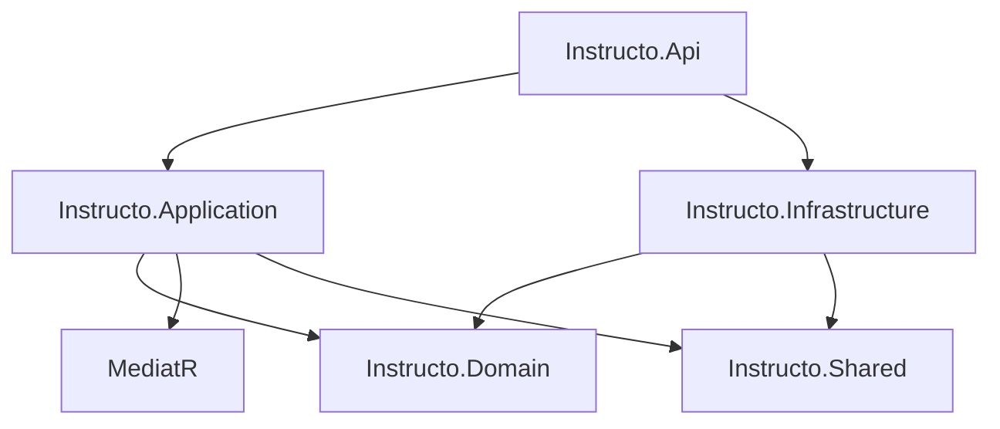

# Source Projects

The Instructo application follows Clean Architecture principles with clear separation of concerns across multiple projects. Each project has specific responsibilities and dependencies that align with architectural boundaries.

## Project Overview

### [[Instructo.Api/README|Instructo.Api]] - Presentation Layer
Web API endpoints and HTTP concerns for the Instructo application. Contains REST API endpoints, middleware, authentication setup, and HTTP-specific configurations.

**Key Responsibilities:**
- HTTP endpoint definitions using ASP.NET Core Minimal APIs
- Authentication and authorization setup
- Request/response handling and validation
- Middleware pipeline configuration

**Main Components:**
- [[Instructo.Api/Endpoints/README|Endpoints]] - REST API endpoint definitions
- [[Instructo.Api/Middleware/README|Middleware]] - Custom HTTP middleware components
- Program.cs - Application startup and configuration

---

### [[Instructo.Application/README|Instructo.Application]] - Application Layer
Business logic implementation using CQRS pattern with MediatR for handling commands and queries.

**Key Responsibilities:**
- Use case implementation through commands and queries
- Business logic orchestration
- Validation pipeline integration
- Cross-cutting concerns through behaviors

**Main Components:**
- [[Instructo.Application/Schools/README|Schools]] - School domain operations
- [[Instructo.Application/Users/README|Users]] - User management operations
- Behaviors - Cross-cutting concern implementations
- Abstractions - CQRS base interfaces and contracts

---

### [[Instructo.Domain/README|Instructo.Domain]] - Domain Layer
Core business domain containing entities, value objects, and domain interfaces. Represents the heart of the business logic.

**Key Responsibilities:**
- Domain entities with business logic
- Value objects for type safety and validation
- Domain service interfaces
- Business rule enforcement

**Main Components:**
- [[Instructo.Domain/Entities/README|Entities]] - Core business entities
- [[Instructo.Domain/ValueObjects/README|ValueObjects]] - Type-safe value objects
- Interfaces - Domain service contracts
- Common - Base classes and shared domain concepts

---

### [[Instructo.Infrastructure/README|Instructo.Infrastructure]] - Infrastructure Layer
Data access, external services, and infrastructure concerns. Implements domain interfaces and provides technical capabilities.

**Key Responsibilities:**
- Database access through Entity Framework Core
- External service implementations
- Data persistence and retrieval
- Infrastructure service implementations

**Main Components:**
- [[Instructo.Infrastructure/Data/README|Data]] - Database context and repositories
- [[Instructo.Infrastructure/Identity/README|Identity]] - Authentication service implementations
- Services - External service implementations
- Configurations - Entity Framework configurations

---

### [[Instructo.Shared/README|Instructo.Shared]] - Shared Layer
Common utilities and shared types used across multiple projects. Contains cross-cutting utilities that don't fit into specific layers.

**Key Responsibilities:**
- Shared enumerations and constants
- Common utility functions
- Cross-project type definitions

---

### [[MediatR/README|MediatR]] - Custom CQRS Implementation
Custom implementation of the MediatR pattern for command/query separation and request handling.

**Key Responsibilities:**
- Request/response pattern implementation
- Command and query handling infrastructure
- Pipeline behavior support
- Dependency injection integration

---

### Additional Projects

#### Instructo.ServiceDefaults (.NET Aspire)
Service configuration defaults for .NET Aspire applications, providing common setup for observability, health checks, and service discovery.

#### Instructo.AppHost (.NET Aspire)
Application orchestration host for .NET Aspire, managing service composition and deployment configuration.

## Architecture Relationships

## Dependency Rules

Following Clean Architecture principles:

1. **Domain** has no external dependencies
2. **Application** depends only on Domain and MediatR
3. **Infrastructure** depends on Domain and Application
4. **Api** depends on Application and Infrastructure
5. **Shared** is referenced by multiple layers as needed

## Key Design Patterns

### CQRS (Command Query Responsibility Segregation)
- **Commands**: Write operations that modify state
- **Queries**: Read operations that return data
- **Handlers**: Process commands and queries
- **Behaviors**: Cross-cutting concerns in the pipeline

### Repository Pattern
- **Generic repositories**: Common CRUD operations
- **Specific repositories**: Domain-specific data access
- **Unit of Work**: Transaction management
- **Query objects**: Complex query encapsulation

### Domain-Driven Design
- **Entities**: Objects with identity and lifecycle
- **Value Objects**: Immutable objects without identity
- **Aggregates**: Consistency boundaries
- **Domain Services**: Business logic that doesn't fit in entities

### Result Pattern
- **Result<T>**: Operation outcome with success/error states
- **Error handling**: Consistent error representation
- **FlexContext**: Chaining operations with error propagation

For detailed information about each project, follow the links to specific project documentation.