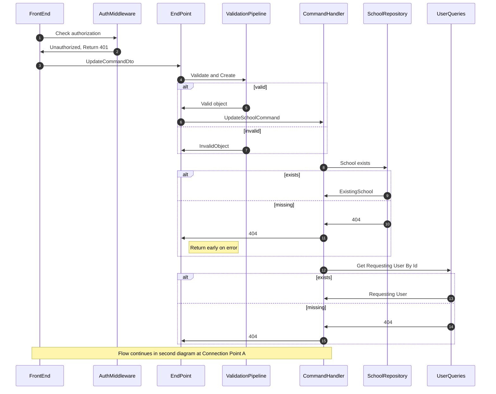

# Update School

This command is a bit more complex that expected. I need to break down the components a bit to make it easier.

First, let's explore what and why is needed.

A school already created should be modifiable through its own dedicated page, basically the school page.

This page will have two variants, one for Owner and one for Admin.
Only the Owner will be able to change the Legal name, to delete the School entirely and to transfer school ownership.

As updatable properties, anything goes, the phone numbers, categories of vehicles, certifications, etc.

As an interface for this end-point, the object will be flexible, and it will look something like this:
```
{
 "id":"",
 "Email":"somenewEmail@School.com"
}
```
Even though the object in the Endpoint is a UpdateSchoolCommandDto that contains all the properties of a School,
it is just that almost all fields are nullable.


